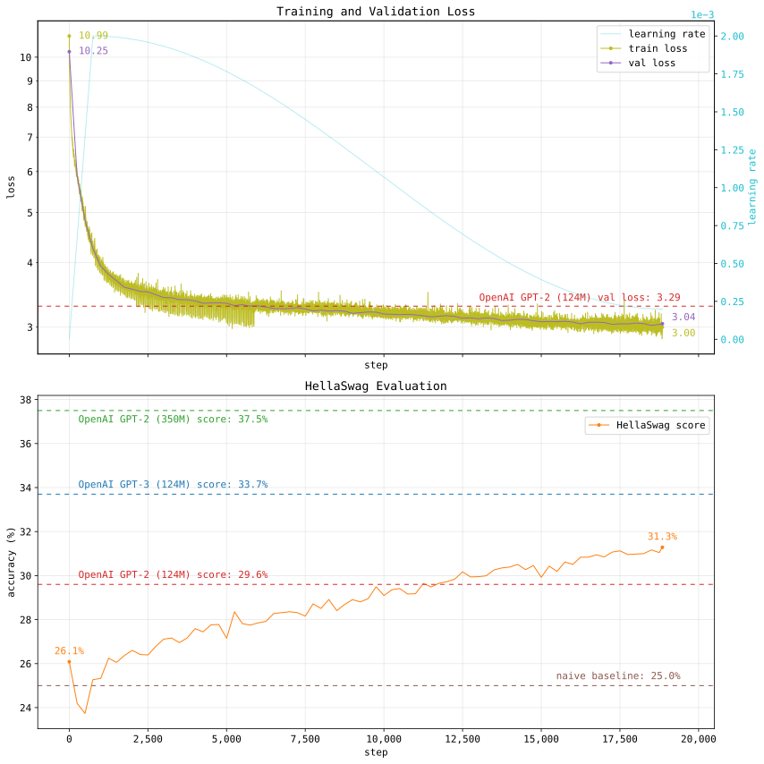

# GPT-2 (124M) Pre-training

A PyTorch implementation of OpenAI's [GPT-2](https://github.com/openai/gpt-2) model with 124 million parameters, coded from scratch and pre-trained on approximately 9.9 billion tokens from the [`sample-10BT`](https://huggingface.co/datasets/HuggingFaceFW/fineweb-edu/viewer/sample-10BT) subset of the [FineWeb-Edu](https://huggingface.co/datasets/HuggingFaceFW/fineweb-edu) dataset. This repository includes all Python scripts for the full data preprocessing, training, and optimisation setup alongside comprehensively documented code for educational purposes. 



*Figure 1: Visualisation of the loss curves and accuracy scores over one epoch of pre-training on `sample-10BT`.*

Training the auto-regressive model for one epoch (equivalent to 18,850 parallel steps using eight GPUs) on the `sample-10BT` dataset achieved a validation loss of **3.04** and a [HellaSwag](https://github.com/rowanz/hellaswag/tree/master/data) accuracy score of **31.3%**. These results surpass OpenAI's original smaller [GPT-2](https://github.com/openai/gpt-2) model with the same number of parameters and architecture. By incorporating both validation and evaluation runs with non-compiled distributed training, a single epoch was completed in ~2.5 hours, equating to ~$36 in compute costs ($1.79/GPU/hr for NVIDIA A100 80GB as of Feb 2025). Graph results indicate continued model performance with additional epochs of training while using a more aggressive learning rate schedule.

## Model Output Examples

Below are examples of text generations by the GPT-2 (124M) model, both untrained and after training.

**Untrained model:**

*Input text: `"The meaning of life is"` ...*

```
... " monksPublisherPublished enforcing Explorerruly answer allele Snapchat
ransomware succumbutyedipeer Teen grep pepperknown questioned remedpb coastline quietlybgö authentic
successors beaten superstar Qual}\cham Gov outspokenmore mothevents ≡unlessAdapter  web officer
imprisoned attainmentinian tendencies192 Dragonbound disciple individuality positivesld PMHi 
vascular Bahamas paymentstitle performingfaces gard Karmastrate uninsured Fuglogin flavours inj
Leyocative lex Ulster THEN Shadnm Pad Rooney Warrant hur Devil heaviest anecdotes overestrics
involves Primary Bir rot Bac serving Learnedhatt email skewed Yen snapshot Icelandic speed Menu
StriIncreasesfriends containment Thursday 214reactq Group Flowers Yorkerasserthat referen
```

**Trained model (after 1 epoch):**

*Input text: `"The Earth is"` ...*

```
" a giant magnet and it is this magnet that keeps our planet’s atmosphere, oceans and
atmosphere from being torn apart by the wind. This magnet is made of iron and nickel, and this
magnet is made of iron. The iron is a magnet that is made from iron, nickel, and oxygen and it is
this iron that keeps us alive. The earth is made of iron and oxygen, but the atmosphere, oceans and
atmosphere are made of oxygen. These are the same elements that are used by the human body to make
up the human body and the earth is made up" ...
```

*Input text: `"In the quiet of the forest, with"` ...*

```
" its large and beautiful trees, I realized I was frightened by some
bandits, who guarded me. After many working nights though, I found them me. A tribe of this tribe
lived near by, in an ignominious way. And they killed me all night long. How strange! How horrible!
How sad! Therefore, I am afraid to die, and they are very desperate. Then the devil aroused the
terror and led me to Hell, by perfectly transparent signs, in which they conured" ...
```

*Input text: `"Lost in the vast, boundless universe, I"` ...*

```
" can tell you that it’s limitless stuff, unimaginable energy
with no boundaries, nothing that could be yet… I think we may glimpse out on another planet, and yet
to my own eyes are really this choice and I’d like to be able to understand all of it. God is not
over-night or something … Thank you so much for rules When a province (individual country) decides
to take women as subjects, the imperial Court will be the next official in charge" ...
```

## Project Files

**Data-related scripts:**
- `load_fineweb.py`: downloads the `sample-10BT` subset of `FineWeb-Edu` as shard NumPy files in a specified directory. 
- `fineweb.py`: defines a custom PyTorch [`Dataset`](https://pytorch.org/docs/stable/data.html#torch.utils.data.Dataset) class to handle shard loading and indexing to return batched FineWeb-Edu tokens. 
- `hellaswag.py`:  defines a custom PyTorch `Dataset` class for rendering and loading examples from the [HellaSwag](https://github.com/rowanz/hellaswag/tree/master/data) dataset. Includes an evaluation function that computes accuracy scores for a specified model. 
- `shakespeare/shakespeare.py`:  defines a custom PyTorch `Dataset` class for loading, tokenizing and batching data from an option of two available Shakespeare text file datasets - [`tiny`](https://raw.githubusercontent.com/karpathy/char-rnn/master/data/tinyshakespeare/input.txt) and [`large`](https://gist.githubusercontent.com/blakesanie/dde3a2b7e698f52f389532b4b52bc254/raw/76fe1b5e9efcf0d2afdfd78b0bfaa737ad0a67d3/shakespeare.txt).

**Model & Training scripts:**
- `model.py`: defines the GPT-2 (124M parameter) model architecture using PyTorch's [`torch.nn`](https://pytorch.org/docs/stable/nn.html#module-torch.nn) modules.
- `config.py`: contains all customisable global hyperparameters, directory paths and settings for model training and optimisation.
- `train.py`: implements the core model training and optimisation loop with loaded datasets. Further supports distributed training across multiple GPUs in parallel using PyTorch's [`DistributedDataParallel`](https://pytorch.org/docs/stable/generated/torch.nn.parallel.DistributedDataParallel.html#torch.nn.parallel.DistributedDataParallel) (DDP).
- `tqdm_bars.py`: defines custom [`tqdm`](https://github.com/tqdm/tqdm) progress bars, with tailored metrics for monitoring during model training in `train.py`, dataset shard downloading in `data/load_fineweb.py`, and optional model evaluation runs on the HellaSwag dataset.

**Executable scripts:**
- `main.py`: initiates the GPT-2 model training and optimisation process.
- `results.py`: visualises training results from a checkpoint directory and loads models to generate text samples.

## Install

Installed dependencies: [`PyTorch`](https://pytorch.org/), [`NumPy`](https://numpy.org/), [Matplotlib](https://matplotlib.org/stable/), [`datasets`](https://huggingface.co/docs/datasets/en/index), [`tiktoken`](https://github.com/openai/tiktoken), [`tqdm`](https://github.com/tqdm/tqdm), [`transformers`](https://huggingface.co/docs/transformers/en/index).

To clone this repository and install the required dependencies:
```
git clone https://github.com/anw-g01/gpt2_124m.git
cd gpt2_124m
pip install -r requirements.txt
```

Test and validate a quick all-reduce calculation with multi-GPU processes with the following `torchrun` command:

```
torchrun --standalone --nproc_per_node=8 train.py
```

Execute a full distributed model training run (using 8 GPUs as an example):

```
torchrun --standalone --nproc_per_node=8 main.py
```

## Data Preprocessing & Loading

**FineWeb-Edu Preprocessing**

- The `sample-10BT` subset of the [FineWeb-Edu](https://huggingface.co/datasets/HuggingFaceFW/fineweb-edu) dataset contains exactly `9,982,590,278` GPT-2 tokens.

The `load_fineweb.py` script loads and tokenizes each document in `sample-10BT` using a GPT-2 tokenizer. Each sequence of tokens is stored sequentially into NumPy array shards, with each shard file (`.npy`) containing exactly 100M tokens — **except** for the last shard which holds exactly `82,590,278` tokens — totalling 100 files of size ~19GB. The order of tokens continues onto the next shard if the current one is fully populated to fit a full document, ensuring that documents spanning across a shard boundary remain contiguous.

**FineWeb-Edu Access & Loading**

The `fineweb.py` script defines a custom PyTorch [`Dataset`](https://pytorch.org/docs/stable/data.html#torch.utils.data.Dataset) class designed to handle the `sample-10BT` shards (already preprocessed using `load_fineweb.py`). This dataset functions as an iterable when utilised with a PyTorch [`DataLoader`](https://pytorch.org/docs/stable/data.html#torch.utils.data.DataLoader), which also supports data partitioning using a [`DistributedSampler`](https://pytorch.org/docs/stable/data.html#torch.utils.data.distributed.DistributedSampler) for distributed training. The batching is handled manually within the `Dataset` class (see `__getitem__()` method) and not passed as a parameter into `DataLoader`.

While shuffling the dataset is possible and can improve training with randomised batch ordering, it is not recommended due to the notable overhead (~300ms per `np.load()`) from repetitive array loading. To mitigate this, all batches are accessed sequentially across shards, with a simple caching mechanism that loads one shard file at a time. This avoids redundant array loading per iteration, enabling faster indexing until the shard is fully processed, after which the next shard is loaded. This approach is suitable for a single epoch of training but may result in suboptimal repeated patterns from batch periodicity over several epochs.

**HellaSwag Dataset**

The [HellaSwag](https://github.com/rowanz/hellaswag/tree/master/data) dataset is a collection of common-sense reasoning tasks, where a given model must predict the most likely continuation of a given sentence, based on its knowledge and perception of the world. Each example provides four possible continuation options, therefore a model making random guesses should expect an accuracy score of 25% as the baseline. Any score above this threshold indicates a model's ability to demonstrate improved reasoning and decision-making. While the benchmark is saturated for recent advanced models, it remains valuable for assessing the reasoning capabilities of smaller language models in aligning with human intuition and everyday understanding.

- The `train`, `val`, and `test` splits contain `39,905`, `10,042`, and `10,003` samples respectively.

The `hellaswag.py` script defines a custom PyTorch `Dataset` class similar to `fineweb.py`. The class handles the tokenization and rendering of the context and endings of each example into tensors. The script includes an evaluation function that iterates through a `DataLoader` to compute the accuracy score on a given split by comparing the model's predictions against the ground truth labels.

## Model Training Overview

- A total of 99 shards (~9.9B tokens) were allocated for training and 1 full shard (100M tokens) for validation.

**Batching & Gradient Accumulation**

A "mini-batch" of tokens is defined as the product of the batch size (`BATCH_SIZE`) and the sequence length (`BLOCK_SIZE`). The hyperparameter `TOKENS_PER_BATCH` specifies the number of tokens in a complete batch before a model weight update. If memory constraints prevent processing a complete batch in one step, gradient accumulation is performed over multiple smaller mini-batches before backpropagation.

With the training hyperparameters set to `BATCH_SIZE = 64`, `BLOCK_SIZE = 1024`, and `TOKENS_PER_BATCH = 524,288`, a single GPU process requires `524,288 / (64 * 1024) = 8` gradient accumulation steps before backpropagation. Therefore training with eight GPUs in parallel requires only a single forward pass (i.e. one accumulation step per GPU) before all-reduce and a weight update, leading to faster training.

**Validation & Evaluation**

Validation is performed every `VAL_INTERVAL` step(s) or at the end of each epoch. The validation loss is computed over `VAL_ACCUM_STEPS` mini-batches, which are accumulated and averaged to estimate the model's performance on a large token sample. The number of tokens processed per GPU is given by `BATCH_SIZE * BLOCK_SIZE * VAL_ACCUM_STEPS`. With `VAL_INTERVAL = 20`, this results in `64 * 1024 * 20 = 1,310,720` tokens per GPU, therefore running eight processes in parallel amounts to `1,310,720 * 8 = 10,485,760` total tokens processed per validation run.

Additionally, if enabled, the model is evaluated on the `val` subset of the [HellaSwag](https://github.com/rowanz/hellaswag/tree/master/data) dataset on validation runs.

**Progress Logging & Checkpointing**

A custom defined `tqdm` progress bar (defined in `tqdm_bars.py`) displays real-time statistics tailored to the training loop defined in `train.py`, including detailed progress metrics printed for each validation run or epoch completion.


Model checkpoints storing model weights, loss values and accuracy scores are written and saved to a designated log directory (`LOG_DIR`) only during validation runs. Additionally, there is an option to save checkpoints after every `CHECKPOINT_INTERVAL` validation(s).  

## Acknowledgements

Significant credit goes to [Andrej Karpathy](https://github.com/karpathy) for his insightful YouTube tutorial [Let's reproduce GPT-2 (124M)](https://www.youtube.com/watch?v=l8pRSuU81PU), which served as a valuable resource and guide. The provided scripts incorporate several refactorings, modifications, and custom configurations applied to the data processing and training setup to replicate similar results.